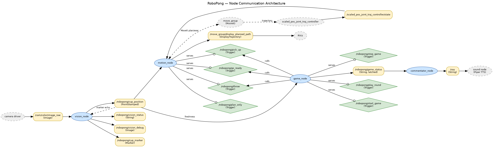

# RoboPong

A ROS (catkin) package that turns a **UR5e** arm into an autonomous beer‑pong
thrower. An overhead camera finds a red cup, the system aims the arm at it, and
a ballistic underhand swing launches a ball toward the cup — with a live TTS
commentator narrating the action.

The pipeline is split into four cooperating nodes: **vision** (find the cup),
**motion** (plan and execute the throw), **game** (orchestrate a round), and
**commentator** (speak status updates).

## Architecture



*RoboPong — node communication architecture. The camera driver feeds
`vision_node`, which publishes the cup position. `game_node` sequences a round
by calling `motion_node`'s services, which in turn drive MoveIt (`/move_group`)
and the scaled joint trajectory controller. `commentator_node` turns game
status into Piper/espeak TTS on `/say`.*

### Data & control flow

1. **`vision_node`** subscribes to the camera (`/cam/color/image_raw`),
   segments the red cup in HSV, maps the pixel to the robot **base frame** via a
   pre‑calibrated homography, and publishes `/robopong/cup_position`
   (`geometry_msgs/PointStamped`). It also publishes a status string, an
   annotated debug image, and an RViz marker of the cup.
2. **`game_node`** orchestrates one round: it calls `pick_up`, dwells while a
   human loads a ball, waits for a *fresh* cup detection, then calls `throw`. It
   publishes `/robopong/game_status` (latched) and exposes `play_round`,
   `start_game`, and `stop_game` triggers.
3. **`motion_node`** owns the arm. `pick_up`/`go_ready` use **MoveIt** for a
   slow, collision‑aware wind‑up; `throw` re‑reads the cup, aims the shoulder
   pan, generates a time‑synchronised **Ruckig** 3‑DoF swing, and executes it
   through the scaled joint trajectory controller. The controller's abrupt hold
   at the launch pose (with non‑zero release velocity) brakes the arm and flings
   the ball.
4. **`commentator_node`** maps `game_status` transitions to spoken lines on
   `/say` (Piper TTS / `espeak-ng`). It is standalone and safe to disable.

## ROS interface

### Nodes

| Node | File | Role |
|------|------|------|
| `vision_node` | `src/vision_node.py` | Detect cup, publish base‑frame position |
| `motion_node` | `src/motion_node.py` | MoveIt wind‑up + Ruckig throw swing |
| `game_node` | `src/game_node.py` | Round orchestration / state machine |
| `commentator_node` | `src/commentator_node.py` | Status → TTS commentary |

### Topics

| Topic | Type | Pub → Sub |
|-------|------|-----------|
| `/cam/color/image_raw` | `sensor_msgs/Image` | camera → `vision_node` |
| `/robopong/cup_position` | `geometry_msgs/PointStamped` | `vision_node` → `motion_node`, `game_node` |
| `/robopong/vision_status` | `std_msgs/String` | `vision_node` |
| `/robopong/vision_debug` | `sensor_msgs/Image` | `vision_node` (annotated feed) |
| `/robopong/cup_marker` | `visualization_msgs/Marker` | `vision_node` → RViz |
| `/robopong/game_status` | `std_msgs/String` (latched) | `game_node` → `commentator_node` |
| `/say` | `std_msgs/String` | `commentator_node` → TTS |
| `/move_group/display_planned_path` | `moveit_msgs/DisplayTrajectory` | `motion_node` → RViz |

### Services (all `std_srvs/Trigger`)

| Service | Provided by | Effect |
|---------|-------------|--------|
| `/robopong/pick_up` | `motion_node` | Move to the cocked pickup pose |
| `/robopong/go_ready` | `motion_node` | Move to the aimed ready pose |
| `/robopong/throw` | `motion_node` | Aim + execute the throw swing |
| `/robopong/plan_only` | `motion_node` | Dry‑run: plan + plot, don't move |
| `/robopong/play_round` | `game_node` | Run one full pickup → throw cycle |
| `/robopong/start_game` | `game_node` | Loop rounds continuously |
| `/robopong/stop_game` | `game_node` | Stop the loop after the current round |

## Repository layout

```
robopong/
├── launch/robopong.launch        # Top-level launch (vision, motion, game, commentator)
├── src/
│   ├── vision_node.py            # Cup detection + homography → base frame
│   ├── motion_node.py            # MoveIt wind-up + Ruckig throw
│   ├── game_node.py              # Round orchestration
│   ├── commentator_node.py       # game_status → TTS
│   └── homography_calibration.py # One-time camera↔workspace calibration tool
├── config/
│   ├── homography.yaml           # Calibrated pixel→workspace homography + workspace center
│   └── robopong.rviz             # RViz layout
├── robots/
│   ├── basic_setup.urdf.xacro    # UR5e + table + scoop end-effector + walls
│   └── meshes/                   # scoop.stl, bowl_2.stl
└── report/                       # Write-up, figures (incl. node_architecture.png), throw plots
```

## Prerequisites

- **ROS 1** (Noetic) with a working catkin workspace
- **MoveIt** and the UR5e bringup/MoveIt config packages
  (`cu_ur5e_bringup`, `cu_ur5e_moveit_config`, `cu_ur5e_description`)
- Python deps: `ruckig` (`python3-ruckig`), `opencv-python`, `numpy`,
  `pyyaml`, `cv_bridge`, `matplotlib`
- An overhead RGB camera publishing to `/cam/color/image_raw`
- TTS: `espeak-ng` (and/or Piper) for the commentator

## Build

From your catkin workspace root:

```bash
cd ~/ros          # your catkin_ws
catkin build       # or: catkin_make
source devel/setup.bash
```

## Calibration

The homography in `config/homography.yaml` maps camera pixels to a
workspace‑local plane, and records the workspace center in the robot `base`
frame. To recalibrate (e.g. after moving the camera or table):

```bash
rosrun robopong homography_calibration.py
```

Click the four workspace corners in order — **Top‑Left, Top‑Right,
Bottom‑Right, Bottom‑Left** — then press `s` to save. Measure the workspace
center in the base frame (`rosrun tf tf_echo base table_top`) and set it in the
script before running.

## Running

Bring up the robot, MoveIt, camera, and all RoboPong nodes:

```bash
roslaunch robopong robopong.launch          # real hardware
roslaunch robopong robopong.launch sim:=true # simulation (MoveIt demo)
```

Then trigger the game:

```bash
# One round (pickup → load ball → wait for cup → throw)
rosservice call /robopong/play_round

# Continuous play
rosservice call /robopong/start_game
rosservice call /robopong/stop_game
```

Useful for tuning without moving the arm:

```bash
rosservice call /robopong/plan_only   # plan + dump trajectory plot only
```

## How the throw works

The throw is a fixed three‑waypoint swing on three joints — `shoulder_lift`,
`elbow`, and `wrist_1`:

- **A — ready/cocked** → **B — release** → **C — follow‑through/decel**

`motion_node` builds two time‑synchronised **Ruckig** segments at 1 ms
resolution: A→B accelerates to a non‑zero **release velocity** (`OMEGA`), and
B→C decelerates back to rest. The controller's hold at the launch pose brakes
the arm sharply at B, releasing the ball from the scoop end‑effector. The
shoulder *pan* is offset by `atan2(cup_y, cup_x)` so the swing points at the
detected cup; pan and `wrist_2/3` are otherwise held constant.

Every throw attempt dumps a CSV and a planned‑vs‑executed plot to
`~/robopong_throws/` for analysis.

## Tunable parameters

**`game_node`** (launch params):

| Param | Default | Meaning |
|-------|---------|---------|
| `ball_load_delay` | 10.0 s | Dwell at pickup for a human to load a ball |
| `cup_wait_timeout` | 10.0 s | Max wait for a fresh cup before aborting |
| `cup_fresh_threshold` | 2.0 s | A cup detection is "fresh" within this age |
| `inter_round_delay` | 3.0 s | Pause between rounds in continuous mode |

**`vision_node`** (launch params): `camera_topic`, `z_height` (table surface Z
in base, default 0.72 m), `min_area`, `smoothing_frames`, `jump_threshold_m`.

**`motion_node`** (module constants in `src/motion_node.py`): joint pose vectors
(`PICKUP_POS`, `READY_POS`, `RELEASE_POS`, `DECEL_POS`), `OMEGA` release
velocity, `MAX_VEL/ACCEL/JERK` limits, and `AIM_OFFSET`.
